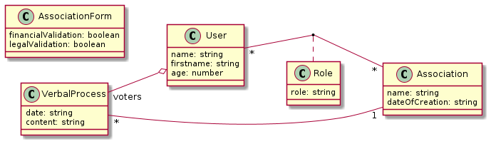
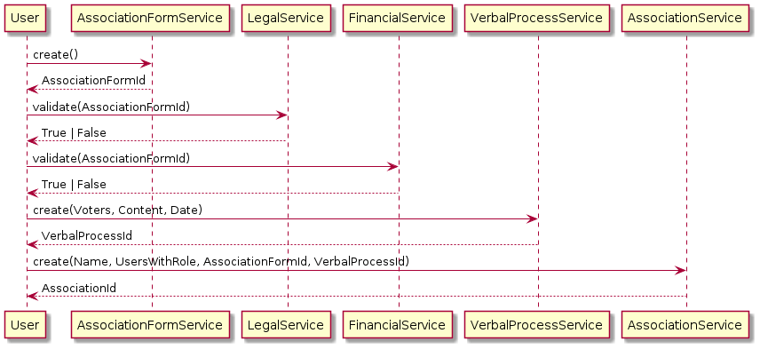

# Développement

Dans cette partie du projet, nous passerons à du développement un peu plus poussé.
Dans la suite, un cahier des charges sera à votre disposition. Vous avez pour but d'implémenter un service web qui 
répondra à ce cahier des charges.
Vous pouvez (et vous devriez) partir de la solution que nous avons construite durant les parties précédentes du projet.

## À propos des requêtes et de la base de données

Pour les requêtes sur la base de données, nous avons vu l'utilisation du `find({xx: Equal(xx) })`.
Sachez qu'il existe une autre syntaxe :

```typescript
myRepository.find({
    where: {
        id: idToFind
    }
})
```

Celle-ci a l'avantage de fonctionner lorsque vous faites des requêtes en fonction de clé étrangère / clé composite.

Concernant la base de données, la manipulation en ligne de commande peut être fastidieuse. Rien ne vous empêche 
d'utiliser [sqlitebrowser](https://sqlitebrowser.org/).


## Entités

Voici le diagramme de classes de l'application :



À vous d'implémenter les entités (avec NestJS et TypeORM) correspondantes.
On vous laissera la liberté de faire le nécessaire pour permettre le mapping vers la base de données.
Vous veillerez bien évidement à fournir une API Rest CRUD pour chaque entité, ainsi que le respect des bonnes pratiques.

Pour des questions de simplicité, nous emploierons des chaînes de caractères pour représenter les dates. La problématique
de représentation des dates n'est pas le sujet du projet.

Concernant les clés primaires, vous utiliserez des entiers (id) pour identifier les lignes, sauf pour :
- `Association` : on utilisera le nom
- `Role` : on utilisera une [clé composite]() des clés de l'utilisateur et de l'association en question

Si vous avez des soucis avec le lancement du backend et des erreurs du type : 

```txt
ExceptionHandler] Nest cannot create the VerbalProcessesModule instance.
The module at index [0] of the VerbalProcessesModule "imports" array is undefined.

Potential causes:
- A circular dependency between modules. Use forwardRef() to avoid it. Read more: https://docs.nestjs.com/fundamentals/circular-dependency
- The module at index [0] is of type "undefined". Check your import statements and the type of the module.

Scope [AppModule -> AssociationsModule]
```

Voyez ce post dédié à la [gestion des dépendances cycliques](./gestion_dependances_cycliques.md).

## Logique de création

La création d'association doit suivre une procédure bien particulière.
Pour ce faire, l'utilisateur doit fournir :

- La liste des membres, ainsi que chaque rôle de chaque membre (président, trésorier, adhérent, etc.)
- Un nom
- Un formulaire de création (AssociationForm) qui a été validé par deux services (qui sont accessibles via des apis 
  dédiées) : financier et légal.
- Un procès verbal d'assemblée générale de création

Le formulaire de création (AssociationForm) doit être d'abord créé auprès du service dédié. Une fois que l'utilisateur 
possède le numéro unique du formulaire, il peut demander les validations auprès des services en fournissant le numéro.
Une fois les validations faites, l'utilisateur peut fournir la liste des membres et leurs rôles, le nom de l'association,
le formulaire ainsi que le procès verbal de création au service `associations` (via l'API dédiée) afin de finalement créer l'association.

La procédure est résumée dans le diagramme de séquence suivant :



On supposera que tous les utilisateurs existent en base. Une fois l'association créée (ainsi que les roles), le serveur 
supprimera automatiquement le formulaire de création (AssociationForm).

## APIs spécifiques

Une fois les CRUD implémentés pour toutes les entités, nous voulons offrir à nos clients la possibilité de récupérer des
informations spécifiques :

* La liste de tous les membres d'une association, identifiée par son nom, avec pour chaque membre son nom, son prénom, 
  son âge et son rôle au sein de l'association ;
* La liste de tous les rôles d'un utilisateur identifié par son `id` ;
* La liste de tous les utilisateurs qui ont un rôle donné, identifié par son nom (le nom du rôle) ;
* La liste de tous les procès verbaux d'une association, et pouvoir les trier en fonction de la date ou du nombre de votants.

Pour les membres, n'hésitez pas à créer une nouvelle classe qui portera les informations que vous voulez transmettre, 
voir plus bas.

Plus d'informations dans la documentation officielle de [TypeORM](https://typeorm.io/#/find-options).
En particulier, le paramètre `order` de la méthode `find()` de la class `Repository`.

Ce [post StackOverFlow](https://stackoverflow.com/questions/11508463/javascript-set-object-key-by-variable) peut 
également vous aider pour gérer les paramètres de tri.

## DTO mapping

Nous voulons simplifier le service web, en donnant plus de données avec une requête.
Le but est ici de transformer les objets métiers, manipuler par le serveur en *Data Transfert Object* (DTO), des versions de ces objets mais spécialisés pour le transfert.
Au lieu de fournir les associations comme ils sont définits en base, nous voulons en plus de ces données, ajouter les informations sur les membres : les données utilisateur et les données des rôles.
Pour ce faire, implémenter les classes suivantes :


Et modifier votre backend pour que les APIs des `associations` ne renvoient plus une (des) `Association` mais plutôt des 
`AssociationsDTO`.

## Scripts de test

Pour tester votre backend vous pourrez utiliser les scripts de tests suivants
* TBD : CRUD pour toutes les entités
* [Logique de création des association](./scripts/developpement_association_creation_test.sh)
* TBD : DTO
