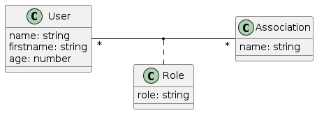
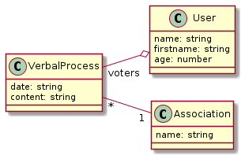
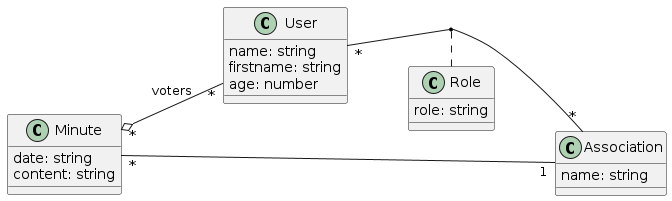
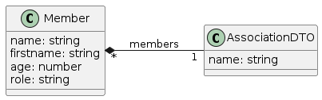

# Développement

Pour conclure le projet, nous passerons à du développement un peu plus poussé.
Dans la suite, un cahier des charges sera à votre disposition. Vous avez pour but d'implémenter un service web qui 
répondra à ce cahier des charges.
Vous pouvez (et vous devriez) partir de la solution que nous avons construite durant les parties précédentes du projet.
Aussi, n'hésitez surtout pas à retourner sur les autres TPs qui vous ont guidés.
Par exemple, si vous ne savez plus générer un nouveau module ou un service, 
il vous suffira de retourner sur le [TP3. Modules et logique métier](./modules_et_logiques_metiers.md).

## À propos des requêtes et de la base de données

Pour les requêtes sur la base de données, nous avons vu l'utilisation du `find({xx: Equal(xx) })`.
Sachez qu'il existe une autre syntaxe :

```typescript
myRepository.find({
    where: {
        id: idToFind
    }
})
```

Celle-ci a l'avantage de fonctionner lorsque vous faites des requêtes en fonction de clé étrangère / clé composite.

Concernant la base de données, la manipulation en ligne de commande peut être fastidieuse. Rien ne vous empêche 
d'utiliser [sqlitebrowser](https://sqlitebrowser.org/).

## Nouvelles entités

Pour chacune des entités décrites ci-dessous, développer tout ce qui est nécessaire (dans toutes les couches) pour supporter 
toutes les opérations CRUD.

### Roles

Nous souhaitons tout d'abord intégrer une notion de "role", par exemple Président, Trésorier, Secretaire, etc.
Chaque `User` peut avoir un rôle different en fonction de l'association.
La relation entre les trois entités `Role`, `User` et `Association` est décrite par le diagramme de classes ci-dessous:

on utilisera une **clé composite** des clés de l'utilisateur et de l'association en question.



Nous fournissons la classe de données d'entrées (dans un fichier `role.input.ts` par exemple) pour la création des roles :

```ts
import { ApiProperty } from "@nestjs/swagger"

export class RoleInput {
    @ApiProperty({
        description: 'The name of the role of the given user in the given association',
        example: "President",
        type: String,
    })
    public name: string;

    @ApiProperty({
        description: 'The id of the user',
        example: "1",
        type: Number,
    })
    public idUser: number;

    @ApiProperty({ 
        description: 'The id of the association',
        example: "1",
        type: Number,
    })
    public idAssociation: number
}
```

et leur mis à jour (dans un fichier `role.update.ts` par exemple):

```ts
import { ApiProperty } from "@nestjs/swagger"

export class RoleUpdate {

    @ApiProperty({
        description: 'The new name of the role of the given user in the given association',
        example: "President",
        type: String,
    })
    public name: string;
}
```

Ainsi qu'un fichier de tests : [crud_roles.sh](./scripts/crud/crud_roles.sh).
Vous noterez que les endpoints sont configurés d'abord par l'id de l'utilisateur, puis par l'id de l'association. Par exemple:

```sh
get http://localhost:3000/roles/1/2
```

retourne le role de l'utilisateur avec l'`id = 1` au sein de l'association avec l'`id = 2`.

### Procès Verbal (Minutes)

Les procès verbaux sont des documents texte qui contiennent le compte rendus des assemblés générales des associations.
Les associations doivent tenir une assemblée générale lors de leur création et une fois par an au moins.

Lors des assemblées générales, les membres des associations peuvent votés pour des résolutions ou des mentions, et sont donc inscrits 
en tant que "votant" (voters) sur le procès verbal correspondant.

La relation entre les trois entités `Minutes`, `User` et `Association` est décrite par le diagramme de classes ci-dessous:



De la même manière, voici la classe de données d'entrées pour la création des `Minutes` :

```ts
import { ApiProperty } from "@nestjs/swagger"

export class MinuteInput {

    @ApiProperty({
        description: 'The content of the minute, should relate the accepted motions',
        example: "Lorem ipsum dolor sit amet, consectetur adipiscing elit. Vestibulum et sagittis sem. Praesent sollicitudin lacus.",
        type: String,
    })
    public content: string;

    @ApiProperty({
        description: 'The ids of the voters. These should be the same than the users that are members of the association',
        example: "1,2,3",
        type: Int32Array,
    })
    public idVoters: number[];

    @ApiProperty({
        description: 'The date when the general assembly occured',
        example: "12/12/2021",
        type: String,
    })
    public date: string;

    @ApiProperty({
        description: 'The id of the association',
        example: "1",
        type: Number,
    })
    public idAssocation: number;

}
```

et leur mis à jour:

```ts
import { ApiProperty } from "@nestjs/swagger";

export class MinuteUpdate {

    @ApiProperty({
        description: 'The content of the minute, should relate the accepted motions',
        example: "Lorem ipsum dolor sit amet, consectetur adipiscing elit. Vestibulum et sagittis sem. Praesent sollicitudin lacus.",
        type: String,
    })
    public content: string;

    @ApiProperty({
        description: 'The ids of the voters. These should be the same than the users that are members of the association',
        example: "1,2,3",
        type: Int32Array,
    })
    public idVoters: number[];

    @ApiProperty({
        description: 'The date when the general assembly occured',
        example: "12/12/2021",
        type: String,
    })
    public date: string;

    @ApiProperty({
        description: 'The id of the association',
        example: "1",
        type: Number,
    })
    public idAssocation: number;

}
```

Ainsi qu'un fichier de tests : [crud_minutes.sh](./scripts/crud/crud_minutes.sh).

### Diagramme complet des entités

Voici un diagramme qui montre toutes les entités et leur relations :



## DTO mapping

Nous voulons simplifier le service web, en donnant plus de données avec une seule requête.
Le but est ici de transformer les objets métiers, manipulés par le serveur, en *Data Transfert Object* (DTO), qui sont des versions de ces objets mais spécialisés pour le transfert.
Au lieu de fournir les associations comme elles sont définies en base, nous voulons en plus de ces données, ajouter les informations sur les membres : les données utilisateur et les données des rôles.
Pour ce faire, implémenter les classes suivantes :



avec `AssociationsDTO` dans le fichier `src/associations/association.dto.ts` et `Member` dans le fichier `association.member.ts`.

Et modifier votre backend pour que les APIs des `associations` ne renvoient plus une/des `Association` mais plutôt une/des 
`AssociationsDTO`.

## APIs spécifiques

Une fois les CRUD implémentés pour toutes les entités, nous voulons offrir à nos clients la possibilité de récupérer des
informations spécifiques :

* La liste de tous les rôles d'un utilisateur identifié par son `id` dans le module `users`. Le endpoint correspondant est le suivant : `GET users/:id/roles` ; Lors du développement de cette api, vous allez peut-être confronté à une erreur de dépenddances cycliques. Reportez-vous à la section dédiée ci-dessus pour comprendre et résoudre les problèmes.
* La liste de tous les utilisateurs qui ont un rôle donné, identifié par son nom (le nom du rôle) dans le module `roles`. Le endpoint correspondant est le suivant : `GET roles/users/:name` ;
* La liste de tous les procès verbaux d'une association, et pouvoir les trier en fonction de la date dans le module Associations. Le endpoint correspondant est le suivant : `GET associations/:id/minutes` avec les paramètres: `sort=date` et `order=DESC`

Plus d'informations dans la documentation officielle de [TypeORM](https://typeorm.io/#/find-options).
En particulier, le paramètre `order` de la méthode `find()` de la class `Repository`.

Ce [post StackOverFlow](https://stackoverflow.com/questions/11508463/javascript-set-object-key-by-variable) peut 
également vous aider pour gérer les paramètres de tri.

Nous fournissons deux scripts :

1. [dev_init_db_specific_apis](./scripts/dev_init_db_specific_apis copy.sh) qui va initialiser la base de données avec des requêtes POST
2. [dev_specific_apis](./scripts/dev_specific_apis.sh) qui va réaliser une serie de requêtes GET sur les apis definies juste au-dessus.

L'idée étant, comme il s'agit de tester uniquement les implémentations de certains requêtes GET qui NE modifient PAS la base de données, *
alors on initialise la base de données une fois pour toute avec le premier script;
puis on test l'implémentation des apis spécifiques avec le deuxième script.

### Problèmes possibles : Dépendances cycliques

Si vous avez des soucis avec le lancement du backend et des erreurs du type : 

```txt
ERROR [ExceptionHandler] Nest cannot create the RolesModule instance.
The module at index [1] of the RolesModule "imports" array is undefined.

Potential causes:
- A circular dependency between modules. Use forwardRef() to avoid it. Read more: https://docs.nestjs.com/fundamentals/circular-dependency
- The module at index [1] is of type "undefined". Check your import statements and the type of the module.

Scope [AppModule -> UsersModule]
Error: Nest cannot create the RolesModule instance.
The module at index [1] of the RolesModule "imports" array is undefined.
```

Voyez ce post dédié à la [gestion des dépendances cycliques](./gestion_dependances_cycliques.md).