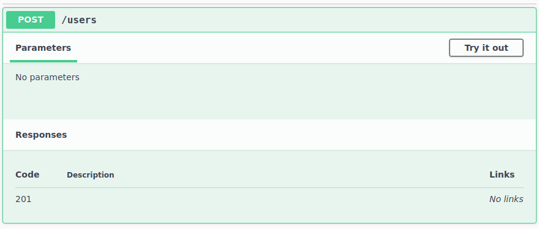
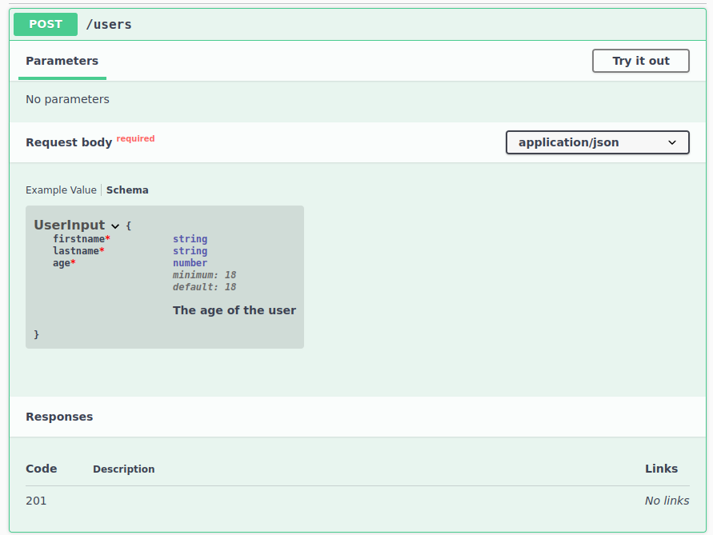

# OpenAPI

Dans cette partie, nous allons ajouter à notre backend une interface **Swagger**, ou [OpenAPI](https://swagger.io/specification/).

## Installation

Pour ce faire, il faut installer les modules requis :

```shell
npm install --save @nestjs/swagger swagger-ui-express
```

Modifiez votre fichier `main.ts`:

```diff
import { NestFactory } from '@nestjs/core';
+import { DocumentBuilder, SwaggerModule } from '@nestjs/swagger';
import { AppModule } from './app.module';

async function bootstrap() {
  const app = await NestFactory.create(AppModule);

+  const config = new DocumentBuilder()
+    .setTitle('Gestion des Associations')
+    .setDescription('Descriptions des APIs de la gestion des associations')
+    .setVersion('1.0')
+    .build();
+  const document = SwaggerModule.createDocument(app, config);
+  SwaggerModule.setup('api', app, document);

  await app.listen(3000);
}
bootstrap();
```

Une fois modifié, relancez votre backend, et connectez-vous à `http://localhost:3000/api/`. Vous devriez obtenir votre 
interface OpenAPI.

## Configuration

### Regroupement d'APIs par tags

Dans la version par défaut, toutes vos APIs devraient être regroupées sous le tag `default`. Pour configurer ces tags, 
il suffit d'ajouter aux `controllers` le décorateur ` @ApiTags('<tag>')`. Par exemple, pour le contrôleur des utilisateurs :

```typescript
/** omis **/
import { ApiTags } from '@nestjs/swagger';

@ApiTags('users')
@Controller('users')
export class UsersController {

    constructor(
/** omis **/
```

Regroupez tous les endpoints sous des tags qui vous semblent cohérents.

### Input

Jusqu'à maintenant, nous définissions nos endpoints `POST` comme ceci :

```typescript
@Post()
public async create(@Body() input: any): Promise<User> {
    return this.service.create(input.firstname, input.lastname, input.age);
}
```

Si on observe l'interface OpenAPI correspondante on a :



Ce qui n'aide pas vraiment. Pour améliorer ça, nous allons créer une nouvelle classe :

```typescript
export class UserInput {
    public firstname: string;
    public lastname: string;
    public age: number;
}
```

et modifier l'input de notre API :

```diff
@Post()
-public async create(@Body() input: any): Promise<User> {
+public async create(@Body() input: UserInput): Promise<User> {
    return this.service.create(input.firstname, input.lastname, input.age);
}
```

Vous pouvez maintenant voir dans l'interface OpenAPI, que le paramètre apparaît.

Aussi, on peut ajouter des décorateurs pour spécifier les codes de retour et les messages en conséquence. Par exemple :

```typescript
@ApiCreatedResponse({
    description: 'The user has been successfully created.'
})
public async create(@Body() input: UserInput): Promise<User> {
    return this.service.create(input.firstname, input.lastname, input.age);
}
```

Il n'y a pas beaucoup d'informations concernant `UserInput`. Il nous faut compléter cela, en ajoutant sur chaque attribut de la class `UserInput` le décorateur 
`@ApiProperty()`.

Vous pouvez compléter les informations du décorateur afin d'enrichir votre documentation OpenAPI comme ceci :

```typescript
import { ApiProperty } from "@nestjs/swagger";

export class UserInput {

    @ApiProperty({
        description: 'The firtname of the user',
        example: "John",
        type: String,
    })
    public firstname: string;

    @ApiProperty({
        description: 'The lastname of the user',
        example: "Doe",
        type: String,
    })
    public lastname: string;

    @ApiProperty({
        description: 'The age of the user',
        minimum: 18,
        default: 18,
        type: Number,
    })
    public age: number;
}
```

Cela apportera, dans l'onglet schéma, de nouvelles informations sur l'utilisation de cette API :



Cela permet également de fournir des données exemples quand à l'utilisation de l'API, vous pourrez alors lancer des requêtes avec ces données pour tester votre backend depuis l'interface OpenAPI grâce au bouton `Try it out`!

Vous pouvez dès à présent créer des objets de données d'entrée pour toutes vos APIs, ainsi que les documenter.

Pour plus d'information sur Swagger avec NestJS, voir la [documentation officielle](https://docs.nestjs.com/openapi/introduction).
